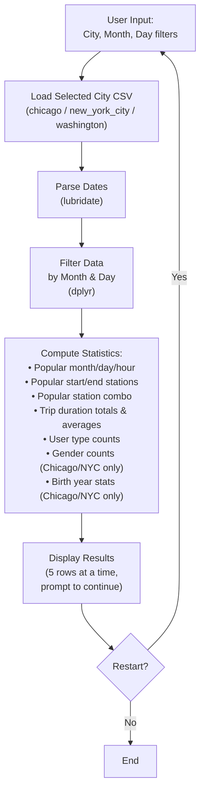

# Exploring US Bikeshare Data (in R)

An interactive command-line-style data exploration tool that analyzes bikeshare usage patterns across three major US cities — built in R, using a Jupyter notebook with the R kernel.

> **Note:** This is a Udacity Data Analyst coursework project ("Explore US Bikeshare Data"), reimplemented in R rather than the typical Python/pandas version, run via a Jupyter notebook with an R kernel (IRkernel).

---

## Business Problem

Bikeshare systems generate a constant stream of trip-level data — but raw trip logs aren't useful to an operations or planning team unless they can be quickly summarized into answers to practical questions: **Which stations are busiest? When do people ride? Who's riding — and for how long?**

This project gives a city operator (or anyone analyzing the data) a way to interactively explore that data without writing new code for every question. The user selects a city and an optional time filter (month and/or day of week), and the tool returns a structured set of usage statistics — the kind of breakdown a transit planner would need to decide where to add docking stations, when to schedule rebalancing trucks, or how to target promotions to specific user segments.

---

## Dataset

This project uses bikeshare trip data for three US cities, provided by Udacity:

| File | City | Notes |
|---|---|---|
| `chicago.csv` | Chicago | Includes gender and birth year data |
| `new_york_city.csv` | New York City | Includes gender and birth year data |
| `washington.csv` | Washington, D.C. | **Does not** include gender or birth year data |

Each row represents a single bike trip, with fields covering start/end time, start/end station, trip duration, and (where available) rider demographics.

**Obtaining the data:** the three CSVs are included directly in this repository. They originate from Udacity's "Explore US Bikeshare Data" project dataset (sourced from each city's bikeshare program — Divvy in Chicago, Citi Bike in NYC, and Capital Bikeshare in D.C.).

---

## Technologies Used

- **R** — core language
- **Jupyter Notebook with IRkernel** — development/execution environment (`Explore_bikeshare_data.ipynb`)
- **[dplyr](https://dplyr.tidyverse.org/)** — data filtering, grouping, and summarization
- **[lubridate](https://lubridate.tidyverse.org/)** — parsing and manipulating trip date/time fields (extracting month, day of week, hour)
- **[ggplot2](https://ggplot2.tidyverse.org/)** — visualization (where used for summary charts)

---

## Architecture



**How it works:**
1. The program prompts the user to choose a **city** (Chicago, New York City, or Washington), a **month** (January–June, or "all"), and a **day of the week** (or "all").
2. The corresponding CSV is loaded and filtered using `dplyr`, with date/time fields parsed via `lubridate`.
3. The tool computes and displays a fixed set of summary statistics (see below).
4. Raw data is shown 5 rows at a time, with the user prompted after each batch on whether to see more.
5. At the end, the user is asked whether to restart the analysis with new filters.

---

## Setup and Execution

### Prerequisites
- R (4.0+ recommended)
- Jupyter Notebook with the R kernel ([IRkernel](https://irkernel.github.io/)) installed

### Installation

```r
# Inside an R session, install the IRkernel and required packages
install.packages(c("IRkernel", "dplyr", "lubridate", "ggplot2"))
IRkernel::installspec()
```

```bash
git clone https://github.com/ZinnNotZen/Exploring-Bikeshare-Via-R.git
cd Exploring-Bikeshare-Via-R
jupyter notebook
```

### Running the analysis

1. Open `Explore_bikeshare_data.ipynb` in Jupyter (it should default to the R kernel).
2. Run all cells. When prompted:
   - Enter a city: `chicago`, `new york city`, or `washington`
   - Enter a month: `january` through `june`, or `all`
   - Enter a day of the week, or `all`
3. Review the displayed statistics. When prompted, choose whether to view raw data 5 rows at a time, and whether to restart with new filters afterward.

A pre-rendered version of a sample run is also included as `Explore_bikeshare_data.html` for viewing without running the notebook yourself.

---

## Sample Output

**Most Popular Motn to Rent a Bike** 


**Average Trip Duration for each City**


---

## Key Findings and Lessons Learned

- **Data availability isn't uniform across cities — and the code has to account for that.** Washington's dataset lacks gender and birth year fields entirely, so any statistics relying on those columns had to be conditionally skipped (or clearly labeled "not available") rather than assumed present for every city.
- **`lubridate` significantly simplifies time-based filtering in R.** Extracting month, day-of-week, and hour from raw timestamp strings — and filtering on them — is far less error-prone with `lubridate`'s parsing functions than manual string manipulation.
- **Interactive, prompt-driven scripts require careful input validation.** Since users can type city/month/day values in different cases or with typos, validating and normalizing input (e.g., case-insensitive matching) was necessary to keep the program from crashing on bad input.
- **Paginating large result sets (5 rows at a time) keeps exploration usable.** Dumping the full raw dataset to the console isn't useful for a human reviewer — letting the user opt into more data incrementally keeps the tool practical for manual inspection.

---

## Possible Extensions

- Add ggplot2 visualizations for the most common stations, trip durations, or hourly ride distribution, rather than printing summary statistics as text only
- Extend the month filter beyond January–June to cover the full year, if more months of data become available
- Refactor the interactive CLI prompts into parameterized function calls, so the analysis could run non-interactively (e.g., from a script or scheduled report)
- Add basic unit tests for the filtering and statistics functions to guard against regressions
